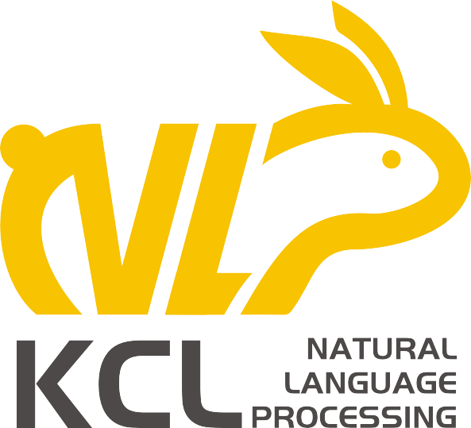

# OpenToM
The official repository of the OpenToM dataset

<p align="center">
  
</p>

**Website**: https://seacowx.github.io/projects/opentom/OpenToM.html

**Repo Structure**

```
├── README.md
├── assets
│   └── figures
├── data
│   ├── opentom.json
│   ├── opentom_data
│   ├── opentom_long.json
│   └── results
└── src
    ├── __init__.py
    ├── evaluate
    ├── evaluate.py
    ├── inference
    ├── prompts
    ├── requirements.txt
    ├── run_baseline.py
    └── utils
```

<span style="color:red;" align="center;"><b>IMPORTANT NOTE:</b> Please avoid testing OpenToM questions in OpenAI playground or places where the data might be used for LLM training.</span>

OpenToM is a new benchmark for assessing LLMs' Neural Theory-of-Mind (N-ToM) with the following key features:
(1) longer and clearer narrative stories
(2) characters with explicit personality traits
(3) actions that are triggered by character intentions
(4) questions designed to challenge LLMs' capabilities of modeling characters' mental states of both the physical and psychological world. 

## Dataset Details

The OpenToM benchmark contains 696 narratives, 596 of which are narratives of normal length (average word count: 194.3 words) and 100 of which are long narratives (average word count: 491.6 words).
Each of the narrative is followed with 23 ToM questions, making a total of 16008 questions.
The OpenToM benchmark pose first-order and second-order questions in the following genres:

1. **Location**: this is a prevelant type of question seen in many ToM benchmarks. We break location questions into *coarse* and *fine*, differ by granularity. *Coarse* questions ask if a character thinks that an entity is in its initial location where as *fine* questions ask the precise location of an entity.
2. **Multihop**: we compose questions that demand an additional reasoning hop on top of the *Location* questions. Specifically, we inquire characters' perception of the *fullness* and the *accessibility* of an entity. We incoporate **social commonsense** in the *accessibility* questions. For instance, if an entity is moved into someone's bag, then it beomces *less accessible* to others since people shall not access other's bag without asking for permission.
3. **Attitude**: LLMs' capability of understanding character's perception of the psychological world has been overlooked by many established N-ToM benchmarks. We propose the *attitude* question to test LLMs' capabilities in understanding character's attitude towards some events. For instance, if my favorite rubber duck is taken away from me without asking, I would hold a *negative* attitude towards this event.

All the OpenToM questions are designed to be a binary or ternary classification task. We recommend using *macro-averaged F1 score* to evaluate LLMs' performance as the labels are not uniformly distributed. 

### Dataset Description

- **Curated by:** KclNLP
- **Funded by [optional]:** KclNLP
- **Language(s) (NLP):** English
- **License:** [More Information Needed]

### Dataset Generating Process

<!-- Provide the basic links for the dataset. -->

- **HuggingFace Dataset:** https://huggingface.co/datasets/SeacowX/OpenToM
- **Paper:** https://arxiv.org/abs/2402.06044

## Uses

The OpenToM dataset is designed to benchmark the performance of LLMs. **It shall not be used for training or fine-tuning. Therefore, <span style="color:red">please avoid testing OpenToM questions in OpenAI playground or places where the data might be used for LLM training.</span>**

## Dataset Structure

<!-- This section provides a description of the dataset fields, and additional information about the dataset structure such as criteria used to create the splits, relationships between data points, etc. -->

`opentom.json` contains the QA data with 13,708 questions derived from 596 OpenToM stories of normal length

`opentom_long.json` contains the QA data with 2,300 questions derived from 100 OpenToM long stories

To access individual question types, nevigate to the **`opentom_data`** folder, in which there is a `metadata.json / metadata_long.json` file containing the metadata of OpenToM. The other JSON files store OpenToM questions of each genre asked for either first-order (fo) or second-order (so) ToM. 
- `location_cg_fo`: Coarse location questions asking about characters' belief of whether an entity is in its initial location (First-Order).
- `location_cg_so`: Coarse location questions asking about characters' belief of whether another character believes that an entity is in its initial location (Second-Order)
- `location_fg_fo`: Fine location questions asking about characters' belief of the precise location of an entity (First-Order).
- `location_fg_so`: Fine location questions asking about characters' belief of another character's belief of the precise location of an entity (Second-Order).
- `multihop_fo`: Multihop questions that requesting additional reasoning hops based on location questions (First-Order).
- `multihop_so`: Multihop questions that requesting additional reasoning hops based on location questions (Second-Order).
- `attitude`: Questions inquire about characters' attitude towards others' actions.

Each metadata contains the following information:
- `plot`: stores the OpenToM plot used to produce an OpenToM story.
- `plot_info`: stores the key information in OpenToM plot, which include the two protangonists, the entity-of-interest, and the two containers.
- `preferences`: stores the first-order and second-order preference belief of the characters.
- `personality`: stores the presonality trait of the *mover*.
- `sentiment_statement`: stores the *mover*'s latent sentiment towards the entity-of-interest.
- `true_sentiment`: stores the *mover*'s latent sentiment towards the entity-of-interest.
- `intention`: stores the *mover*'s latent intention towards the entity-of-interest.
- `new_location`: the new location (fine-grained) of the entity.
- `observed`: documents whether the *observer* witnessed the *mover*'s action.
- `narrative`: the OpenToM narrative.

## Dataset Creation


## Code for Experiment and Evaluation

We provide code for running expriments using OpenToM. Note that running the GPT models require an OpenAI API Key and will be charged for each API call ([OpenAI Pricing](https://openai.com/pricing)). Running the Llama2-Chat and Mixtral-8x7B models require Nvidia graphics cards (~300GB VRAM needed for Llama2-70B in full precision and ~160GB VRAM needed for Llama2-70B, quantized to float16).

### Instruction for Running Experiment

To replicate the experiments in the [paper](https://arxiv.org/pdf/2402.06044.pdf), navigate to the `src` folder.

To run experiment, use the `run_baeline.py` script, which has the following arguments

-   `--model`: specify the model you wish to evaluate. Available models are `['llama-7b', 'llama-13b', 'llama-70b', 'mixtral', 'gpt35', 'gpt4']`.
-   `--question_type`: specify the question genres you wish to evaluate. The default evaluation strategy is to evaluate all question genres.
-   `--config_path`: when running Llama2-Chat and Mixtral-8x7B models, specify generation configurations through this argument. Defaults to `None`.
-   `--cot`: use this flag if you wish to evaluate CoT prompting.
-   `--simtom`: use this flag if you wish to evaluate SimulatedToM prompting.
-   `--selfask`: use this flag if you wish to evaluate Self Ask prompting. 
-   `--lg`: specify the location granularity. Use `coarse` for evaluating $$\texttt{Loc}_{coarse}$$ questions. Use `fine` for evaluating $$\texttt{Loc}_{fine}$$ questions.
-   `--long_narrative`: use this flag if you wish to evaluate using OpenToM-L narratives.
-   `--num_batch`: specify the number of batches (repeated runs) to evaluate. Defaults to 5.
-   `--batch_size`: specify the number of samples in each batch. Defaults to 50.
-   `--seed`: set seed to ensure consistency in sampled data points in each batch.

The evaluation results will be automatically saved to `./data/results/`. The keys of the sampled data points will be automatically saved to `./data/results/sampled_keys/`.


To evaluate the performance of LLMs, use the `evaluate.py` script, which has the following arguments:

-   `--result_path`: specify the path to the resulting JSON file.
-   `--location_granularity`: specify whether the LLMs is evaluated with $\texttt{Loc}_{coarse}$ (`coarse`) or $\texttt{Loc}_{fine}$ (`fine`).
-   `--perspective`: specify which role's (*mover* or *observer*) perspective you wish to evaluate. Defaults to `all` (evaluate questions from all perspectives). 

## Bias, Risks, and Limitations

<!-- This section is meant to convey both technical and sociotechnical limitations. -->

The drafts of OpenToM stories are composed using LLMs. Although some of the stories went through human revision, we acknowledge that the texts generated by LLMs could contain biases and lack lexical diversity.

## Citation

<!-- If there is a paper or blog post introducing the dataset, the APA and Bibtex information for that should go in this section. -->

If you find our benchmark useful, please cite our work:

**BibTeX:**

```
@article{xu2024opentom,
  title={OpenToM: A Comprehensive Benchmark for Evaluating Theory-of-Mind Reasoning Capabilities of Large Language Models},
  author={Xu, Hainiu and Zhao, Runcong and Zhu, Lixing and Du, Jinhua and He, Yulan},
  journal={arXiv preprint arXiv:2402.06044},
  year={2024}
}
```

## Dataset Card Contact

For any question or inquiry about the OpenToM benchmark, please email [hainiu.xu@kcl.ac.uk](mailto:hainiu.xu@kcl.ac.uk)

<p align="center">
  
</p>
